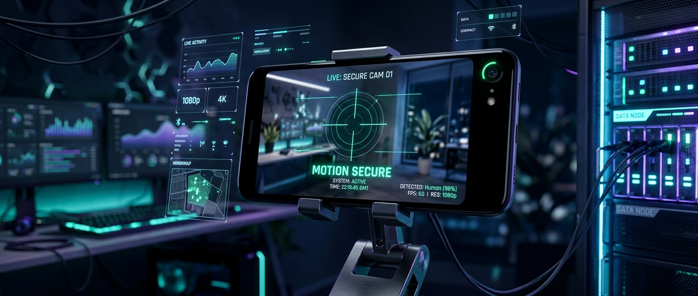
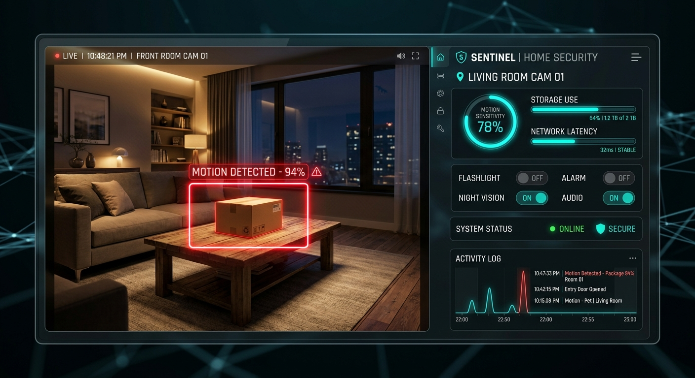

# 🛡️ Smart Sentinel Webcam & Motion Space | সিকিউরিটি এবং মোশন ডিটেকশন সিস্টেম

<p align="center">
  
</p>

একটি অত্যন্ত শক্তিশালী, আধুনিক এবং হাই-পারফরম্যান্স **Android-to-Web সিকিউরিটি ক্যামেরা ও মোশন ডিটেক্টর** প্ল্যাটফর্ম। এটি আপনার অ্যান্ড্রয়েড স্মার্টফোনকে নিমিষেই একটি অ্যাডভান্সড আইপি ওয়েবক্যাম (IP Webcam) এবং স্মার্ট সিকিউরিটি ডিভাইসে রূপান্তরিত করে। সাথে রয়েছে একটি অত্যাধুনিক ও রেসপন্সিভ ওয়েব ড্যাশবোর্ড যার মাধ্যমে দূর থেকে রিয়েল-টাইম কন্ট্রোল করা যায়।

---

## 🚀 প্রধান বৈশিষ্ঠ্যসমূহ (Key Features)

### ১. 📹 অ্যাডভান্সড ডাইনামিক স্ট্রিমিং (Dynamic Streaming)
*   **রিয়েল-টাইম MJPEG স্ট্রীম:** অ্যান্ড্রয়েড ক্যামেরা ইনপুট নিয়ে হাই-স্পিড লোকাল এবং রিমোট স্ট্রিমিং।
*   **ডাইনামিক রেজোলিউশন পরিবর্তন:** ওয়েব ড্যাশবোর্ড বা মোবাইল অ্যাপের মাধ্যমে লাইভ স্টীমের রেজোলিউশন তাত্ক্ষণিকভাবে পরিবর্তন করা সম্ভব:
    *   **High (720p):** ক্রিস্টাল ক্লিয়ার ভিজ্যুয়াল।
    *   **Medium (480p):** পারফেক্ট ব্যালেন্সড পারফরম্যান্স।
    *   **Low (240p):** অতি কম ডেটা খরচে এবং স্লো ইন্টারনেটে স্মুথ স্ট্রিমিং।
*   **ফ্রেম রেট লিমিটেশন (FPS Limiter):** প্রয়োজন অনুসারে ফ্রেম রেট সেট করার সুবিধা (5, 10, 15, 24, 30 FPS)। এর মাধ্যমে ডিভাইসের প্রসেসর এবং ইন্টারনেটের ওপর প্রেশার কমানো যায়।

### ২. 🏃‍♂️ সার্ভার-সাইড মোশন রাডার (Motion Radar)
*   **Pixel Arithmetic & Differencing Engine:** Node.js সার্ভারে `jpeg-js` ব্যবহার করে ফ্রেমগুলোর জটিল পিক্সেল-বাই-পিক্সেল তুলনা করে নড়াচড়া (Motion) চিহ্নিত করা।
*   **লাইভ ইনটেনসিটি মিটার:** স্ক্রিনে ঠিক কত শতাংশ নড়াচড়া হচ্ছে তা ইন্টারেক্টিভ প্রোগ্রেস বারে প্রদর্শন।
*   **অ্যাডজাস্টেবল প্যারামিটার্স:**
    *   **Sensitivity Trigger (%):** কতটুকু পিক্সেল পরিবর্তন হলে অ্যালার্ট ট্রিগার করবে তা স্লাইডার দিয়ে কন্ট্রোল করা।
    *   **Pixel Color Threshold:** কালার পরিবর্তনের সংবেদনশীলতা নির্দিষ্ট করার সুবিধা।
*   **অ্যাক্টিভিটি লগ (Activity Log):** শেষ ১৫টি মোশন অ্যালার্টের ডেটা (কখন শুরু হয়েছিল, সময়কাল কত সেকেন্ড ছিল, সর্বোচ্চ তীব্রতা বা Peak Intensity কত ছিল) নির্ভুল সময়ে ট্র্যাকিং।
*   **লাইভ বাউন্স অ্যালার্ট ও ওভারলে:** মোশন সনাক্ত হওয়ামাত্রই স্ক্রিনে উজ্জ্বল লাল রঙের **"MOTION DETECTED"** অ্যালার্ট পপ-আপ।

### ৩. 📲 প্রক্সি ডিভাইস কন্ট্রোল (Remote Hardware Control)
ওয়েব ড্যাশবোর্ড থেকে সরাসরি অ্যান্ড্রয়েড ফোনের হার্ডওয়্যার কন্ট্রোল করা যায়:
*   **Remote Flashlight Toggle:** দূর থেকে টর্চলাইট জ্বালানো এবং বন্ধ করা।
*   **Camera Switch:** ফ্রন্ট এবং ব্যাক ক্যামেরার মধ্যে রিমোটলি সুইচ করা।
*   **Battery Status Tracking:** ফোনের রিয়েল-টাইম লাইভ ব্যাটারি পার্সেন্টেজ ওয়েব ড্যাশবোর্ডে প্রদর্শন।

---

## 🖥️ ওয়েব ড্যাশবোর্ড প্রিভিউ (Web Dashboard Preview)

<p align="center">
  
</p>

---

## 🏗️ সিস্টেম আর্কিটেকচার (System Architecture)

সিস্টেমটি প্রধানত দুটি স্তরে বিভক্ত যা খুবই অপ্টিমাইজড উপায়ে অত্যন্ত দ্রুত যোগাযোগ করে:

```
[ অ্যান্ড্রয়েড ডিভাইস (CameraX / Kotlin) ] 
       │  (MJPEG Stream / API endpoints via ServerSocket)
       ▼
 [ Node.js সার্ভার প্রক্সি (Express + Jpeg-js) ] 
       │  (Pixel Differencing & UI Control Host)
       ▼
[ ক্লায়েন্ট ওয়েব ব্রাউজার (HTML5 + Tailwind UI + ES6 JS) ]
```

1.  **মোবাইল অ্যাপ্লিকেশন (Android App):** 
    *   **প্রযুক্তি:** Kotlin, Jetpack Compose, CameraX, Coroutines Flow, ServerSocket (NanoHTTPD style)।
    *   এটি মোবাইল ক্যামেরাকে প্রসেস করে এবং একটি লোকাল কাস্টম সার্ভার পোর্ট (ডিফল্ট: `8080`) চালু করে।
2.  **ওয়েব সার্ভার ও অ্যানালিটিক্স প্রক্সি (Node.js Server):**
    *   **প্রযুক্তি:** Node.js, Express, Axios, Jpeg-js।
    *   এটি অ্যান্ড্রয়েড ফোন থেকে আসা স্ট্রিম প্রক্সি করে, পিক্সেল ডিকোড করে রিয়েল-টাইম মোশন মোশন ডিটেক্ট করে এবং ড্যাশবোর্ড UI রেন্ডার করে।

---

## 🛠️ প্রোজেক্ট সেটআপ ও রান করার নিয়ম (Set Up Guide)

### ১. মোবাইল অ্যাপ চালানো (Android App Setup)
1.  অ্যান্ড্রয়েড প্রজেক্টটি **Android Studio**-তে ওপেন করুন।
2.  আপনার অ্যান্ড্রয়েড ফোনটি USB-এর মাধ্যমে ক্যাবল দিয়ে অথবা এমুলেটর যুক্ত করুন।
3.  প্রজেক্ট বিল্ড করার জন্য Run বাটনে ক্লিক করুন অথবা টার্মিনালে রান করুন:
    ```bash
    gradle assembleDebug
    ```
4.  অ্যাপ ওপেন করে পোর্ট নম্বর (উদা- `8080`) দিয়ে **"Start Server"**-এ ক্লিক করুন। স্ক্রিনে ফোনের আইপি অ্যাড্রেস দেখতে পাবেন।

### ২. ওয়েব সার্ভার চালানো (Node.js Proxy Setup)
1.  টার্মিনালে `server` ডিরেক্টরিতে যান:
    ```bash
    cd server
    ```
2.  প্রয়োজনীয় ডিপেন্ডেন্সিগুলো ইনস্টল করুন:
    ```bash
    npm install
    ```
3.  আপনার ফোনের আইপি অ্যাড্রেস অনুযায়ী `.env` ফাইল কনফিগার করুন অথবা এনভায়রনমেন্ট ভেরিয়েবল সেট করুন:
    ```env
    PORT=3000
    WEBCAM_URL=http://YOUR_PHONE_IP:8080
    ```
4.  সার্ভারটি চালু করুন:
    ```bash
    npm start
    ```
5.  এবার ব্রাউজারে `http://localhost:3000` এ প্রবেশ করলেই সম্পূর্ণ ড্যাশবোর্ড উপভোগ করতে পারবেন!

---

## 💰 ব্যবসায়িক সম্ভাবনা ও মনিটাইজেশন কৌশল (Business & Monetization)

এই প্রোজেক্টটিকে সহজেই একটি অত্যন্ত লাভজনক কমার্শিয়াল প্রোডাক্টে রূপান্তর করা সম্ভব। প্রধান পদ্ধতিগুলো নিচে আলোচনা করা হলো:

### ১. ওয়ান-টাইম বা এককালীন সফটওয়্যার বিক্রি (B2B Sell)
ক্ষুদ্র ও মাঝারি ব্যবসায়ীদের কাছে প্যাকেজ বা সম্পূর্ণ সোর্স কোড বিক্রি করতে পারেন:
*   **কাদের কাছে বিক্রি করবেন:** স্থানীয় সিকিউরিটি ফার্ম, ডে-কেয়ার সেন্টার, ছোট দোকানদার, এবং আইটি আউটসোর্সিং ক্লায়েন্টদের কাছে সরাসরি ডেমো দেখিয়ে সেল করা সম্ভব।
*   **সম্ভাব্য মূল্য:** প্রতিটি ক্লায়েন্টের কাছে কাস্টম ব্র্যান্ডিং ও সেটআপ সহ এককালীন **৫০,০০০৳ থেকে ১,৫০,০০০৳** (বা গ্লোবাল মার্কেটে **$৫০০ - $১৫০০**) পর্যন্ত সেল করা সম্ভব।

### ২. সাবস্ক্রিপশন মডেল (SaaS - Software as a Service)
ক্লাউড ব্যাকআপ সহ প্রতি মাসে গ্রাহক থেকে বিল আদায় করতে পারেন:
*   **স্মার্ট হোম সিকিউরিটি সাবস্ক্রিপশন:** ব্যবহারকারী তাদের পুরোনো অ্যান্ড্রয়েড ফোন বা কাস্টম ক্যামেরা দিয়ে সিস্টেমটি ফ্রিতে ব্যবহার করবে, কিন্তু সার্ভার রেকর্ডিং ব্যাকআপ, পুশ নোটিফিকেশন, এবং অটোমেশনের জন্য প্রতি মাসে **৩০০৳ - ৫০০৳** (বা গ্লোবাল মার্কেটে **$৫ - $১০**) ফি প্রদান করবে।

### ৩. কাস্টম আইওটি ও হার্ডওয়্যার সল্যুশন (IoT Integration)
*   সস্তায় চায়না থেকে মিনি প্রসেসর (যেমন Raspberry Pi বা পুরোনো অ্যান্ড্রয়েড ডিভাইস) কিনে তার সাথে কাস্টম কেসিং জুড়ে এই সফটওয়্যার লোড করে আস্ত একটি **"স্মার্ট সিকিউরিটি ডোম ক্যামেরা"** হিসেবে কাস্টমারদের কাছে ক্যুরিয়ারের মাধ্যমে ডেলিভারি দিতে পারেন।

---

### 📝 লাইসেন্স ও অবদান (License & Contribution)
এই সফটওয়্যারটি ওপেন সোর্স এবং কমার্শিয়ালি ব্যবহারযোগ্য। কাস্টম ডেভেলপমেন্ট ও এক্সটেনশন করার জন্য আপনাকে আন্তরিকভাবে স্বাগতম!
